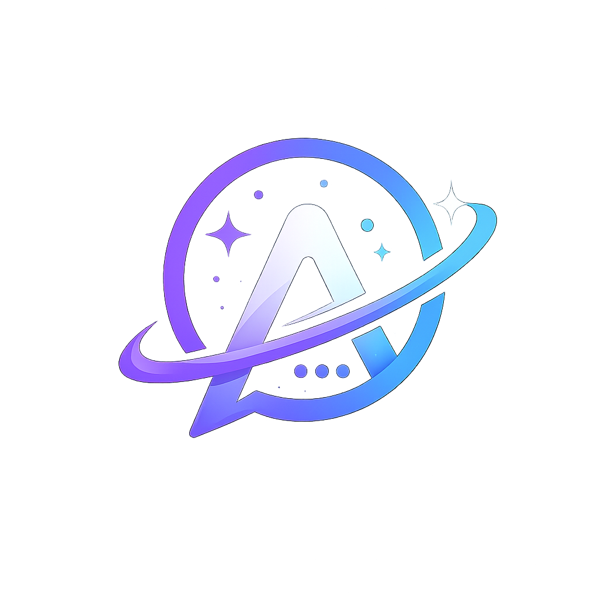

<div align="center">
  

  # 🌌 AstraChat

  **Modern, Real-Time, and Secure Messaging Platform**

  
  
  
  
  

  [Features](#-key-features) • [Tech Stack](#%EF%B8%8F-tech-stack) • [Installation](#-getting-started) • [Deployment](#-easy-push--deployment)
</div>

---

**AstraChat** is a full-featured real-time communication platform offering everything from End-to-End Encrypted text messaging to Peer-to-Peer High-Definition Video Calling. Designed with a sleek, modern, glassmorphism UI, AstraChat delivers a premium user experience perfectly optimized for both Desktop and Mobile devices.

## ✨ Key Features

### 💬 Seamless Real-Time Messaging
- **Direct Messaging (DM):** 1-on-1 private chats with real-time sync.
- **Group Chats:** Create groups, invite friends via codes, and manage members.
- **Read Receipts:** WhatsApp-style checkmarks (1 gray = Sent, 2 gray = Delivered, 2 blue = Read).
- **End-to-End Encryption (E2EE):** Direct messages are encrypted locally using AES-GCM deterministic key derivation (PBKDF2) before ever hitting the server.

### 📞 High-Quality Calls (WebRTC)
- **Voice & Video Calls:** Crystal clear Peer-to-Peer connections with minimal latency.
- **Call Screen Controls:** Mute microphone, disable camera, and toggle fullscreen.
- **Picture-in-Picture:** See your own camera while looking at your friend.
- **Smart Signaling:** Uses Supabase Realtime Broadcast to ring devices instantly.

### 📎 Media & File Sharing
- Send images, videos, audio notes, and documents.
- In-chat image previews and native video/audio playback support.

### 👥 Friend & Task Management
- **Friend System:** Send, accept, and manage friend requests globally.
- **Task Dashboard:** Share tasks to groups, set deadlines, and track real-time countdown timers.

### 🎨 Premium UI/UX
- Modern dark mode tailored with vibrant accent colors.
- Engaging micro-animations, loading skeletons, and smooth screen transitions.

---

## 🛠️ Tech Stack

- **Frontend:** React 19, Vite, React Router DOM, Lucide Icons.
- **Styling:** Tailwind CSS v4 (Custom UI design system).
- **Backend/BaaS:** Supabase (PostgreSQL, Auth, Realtime channels, Storage).
- **Video/Voice:** WebRTC API with Google STUN Servers.
- **Cryptography:** Web Crypto API (AES-GCM, PBKDF2).

---

## 🚀 Getting Started

### 1. Clone the Repository
```bash
git clone https://github.com/alrzkyy/AstraChat.git
cd AstraChat
```

### 2. Install Dependencies
```bash
npm install
```

### 3. Setup Supabase Environment Variables
Create a `.env` file in the root directory and add your Supabase credentials:
```env
VITE_SUPABASE_URL=your_supabase_project_url
VITE_SUPABASE_ANON_KEY=your_supabase_anon_key
```

### 4. Run Locally
```bash
npm run dev
```
The application will start on `http://localhost:5173`.

---

## 📦 Easy Push & Deployment

AstraChat comes with a built-in PowerShell script to make committing and pushing to GitHub (and auto-deploying to Vercel) a breeze.

Simply run the following command in your terminal:
```powershell
.\push.ps1 -msg "Your update message here"
```
*This will automatically run `git add`, `git commit`, and `git push` in one single click.*

---

## 🔒 Security Notes
AstraChat implements strictly configured **Row Level Security (RLS)** on Supabase ensuring users can only read messages in groups or DMs they are explicitly a part of. Furthermore, direct messages are heavily encrypted using the browser's native Crypto API. 

---

<div align="center">
  <i>Built with ❤️ for secure, fast, and beautiful communication.</i>
</div>
